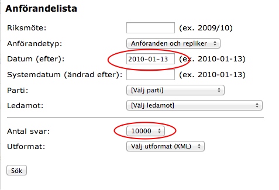

Tutorial: Regular Expressions in Open Refine
===============================

__Data:__ http://data.riksdagen.se/Data/Ledamoter/

###Step 1: Import data
__Data:__ http://data.riksdagen.se/Data/Anforanden/

<pre><code>import re
return re.search("(Herr) talman", value).group(1)
</code></pre>

Reference
---------
http://www.tutorialspoint.com/python/python_reg_expressions.htm
